# AWS Bedrock Chatbot - Architecture Diagram

## System Architecture

```mermaid
graph TB
    subgraph "User Interface"
        A[👤 User Terminal<br/>Interactive CLI]
    end
    
    subgraph "Application Layer"
        B[🐍 Python Application<br/>app.py]
        C[🔧 BedrockChatbot Class]
        D[💬 Conversation History<br/>Context Management]
    end
    
    subgraph "AWS SDK Layer"
        E[📦 boto3 SDK]
        F[🔐 AWS Credentials<br/>IAM Authentication]
    end
    
    subgraph "AWS Bedrock Service"
        G[🌐 Bedrock Runtime API<br/>us-east-1]
        H[🔄 Model Router]
    end
    
    subgraph "Foundation Models"
        I[🤖 Claude 3.7 Sonnet<br/>Primary Model]
        J[⚡ Claude 3.5 Sonnet v2<br/>Fallback 1]
        K[🚀 Claude 3.5 Haiku<br/>Fallback 2]
        L[📊 Amazon Titan<br/>Fallback 3]
    end
    
    subgraph "AWS Infrastructure"
        M[💳 AWS Billing<br/>Payment Method]
        N[🔑 Model Access Control<br/>IAM Permissions]
    end
    
    A -->|User Input| B
    B -->|Initialize| C
    C -->|Maintain| D
    C -->|API Call| E
    E -->|Authenticate| F
    E -->|InvokeModel| G
    G -->|Select Model| H
    H -->|Route Request| I
    H -->|If Unavailable| J
    H -->|If Unavailable| K
    H -->|If Unavailable| L
    I -->|Response| G
    J -->|Response| G
    K -->|Response| G
    L -->|Response| G
    G -->|JSON Response| E
    E -->|Parse| C
    C -->|Format| B
    B -->|Display| A
    
    M -.->|Validates| N
    N -.->|Grants Access| G
    
    style A fill:#e1f5ff
    style B fill:#fff4e1
    style I fill:#c8e6c9
    style G fill:#f8bbd0
    style M fill:#ffccbc
```

## Component Details

### 1. User Interface Layer
- **Terminal CLI**: Interactive command-line interface
- **Input/Output**: Real-time message exchange
- **Commands**: chat, clear, exit/quit

### 2. Application Layer
- **app.py**: Main application entry point
- **BedrockChatbot Class**: Core chatbot logic
  - Model initialization
  - Request/response handling
  - Error management
- **Conversation History**: Maintains context for Claude models

### 3. AWS SDK Layer
- **boto3**: AWS SDK for Python
- **bedrock-runtime client**: Specialized Bedrock API client
- **Authentication**: Uses AWS credentials (IAM)

### 4. AWS Bedrock Service
- **Runtime API**: Model invocation endpoint
- **Region**: us-east-1 (configurable)
- **Model Router**: Automatic fallback system
- **Request/Response**: JSON-based communication

### 5. Foundation Models
- **Primary**: Claude 3.7 Sonnet (newest)
- **Fallback Chain**: 3.5 Sonnet v2 → 3.5 Haiku → Titan
- **Capabilities**: 
  - Natural language understanding
  - Context-aware responses
  - Multi-turn conversations

### 6. AWS Infrastructure
- **Billing**: Payment method validation
- **IAM**: Identity and access management
- **Model Access**: Permission-based model availability

## Data Flow Sequence

## Error Handling Flow

## Security Architecture

## Deployment Architecture

```mermaid
graph TB
    subgraph "Development Environment"
        A[💻 macOS Local Machine]
        B[🐍 Python 3.14<br/>Virtual Environment]
        C[📦 Dependencies<br/>boto3, botocore]
    end
    
    subgraph "Configuration"
        D[🔐 AWS Credentials<br/>~/.aws/credentials]
        E[⚙️ AWS Config<br/>~/.aws/config]
        F[📝 .env File<br/>Optional Settings]
    end
    
    subgraph "Application Files"
        G[app.py<br/>Main Application]
        H[check_models.py<br/>Diagnostics]
        I[test_connection.py<br/>Connection Test]
    end
    
    subgraph "AWS Cloud"
        J[🌐 AWS Bedrock<br/>us-east-1]
        K[🤖 Foundation Models]
    end
    
    A --> B
    B --> C
    A --> D
    A --> E
    A --> F
    B --> G
    B --> H
    B --> I
    G --> J
    H --> J
    I --> J
    J --> K
    
    style A fill:#e3f2fd
    style J fill:#fff3e0
    style K fill:#e8f5e9
```

## Model Selection Logic

## Technical Stack

| Layer | Technology | Purpose |
|-------|-----------|---------|
| **Language** | Python 3.14 | Application development |
| **AWS SDK** | boto3 1.42.25+ | AWS service integration |
| **API** | Bedrock Runtime | Model invocation |
| **Models** | Claude 3.x/3.5/3.7 | AI responses |
| **Authentication** | AWS IAM | Security & access control |
| **CLI** | Interactive Terminal | User interface |
| **Package Manager** | pip | Dependency management |
| **Environment** | venv | Isolation & reproducibility |

## Key Features

### ✅ Implemented
- Multi-model fallback system
- Conversation history management
- Real-time error handling
- Payment validation detection
- Model availability diagnostics
- Interactive CLI interface
- AWS credential integration
- Graceful degradation

### 🔄 Configuration Options
- Region selection (default: us-east-1)
- Model preference ordering
- Temperature & Top-P parameters
- Max token limits
- Retry logic

### 🛡️ Security Features
- AWS IAM authentication
- Credential file protection
- No hardcoded secrets
- Secure API communication
- Permission-based access control

---

## Getting Started

1. **Setup**: Run `./setup.sh`
2. **Configure**: Set AWS credentials
3. **Enable**: Activate models in AWS Console
4. **Test**: Run `python check_models.py`
5. **Chat**: Run `python app.py`

For detailed setup instructions, see [USER_GUIDE.md](USER_GUIDE.md)

---

**Version**: 1.0.0  
**Last Updated**: January 2026  
**Author**: Atul Kamble
